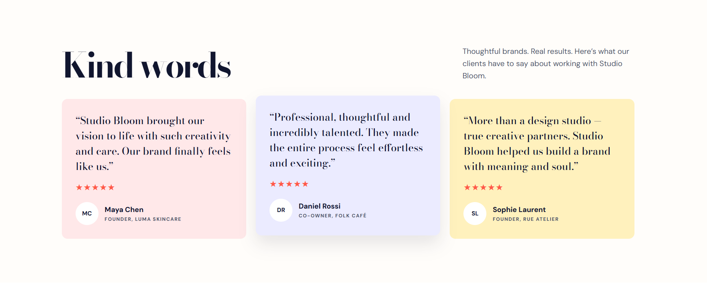
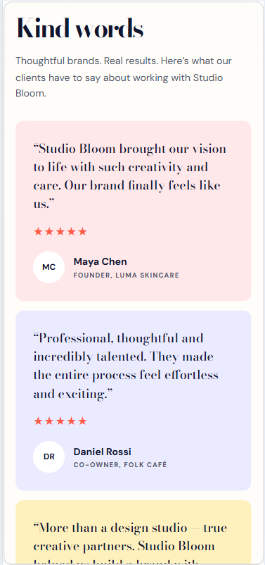
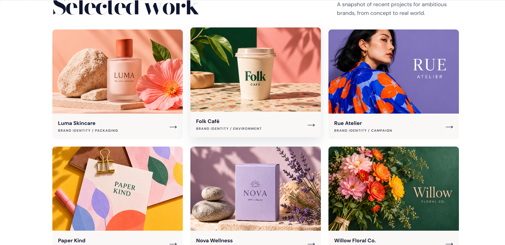
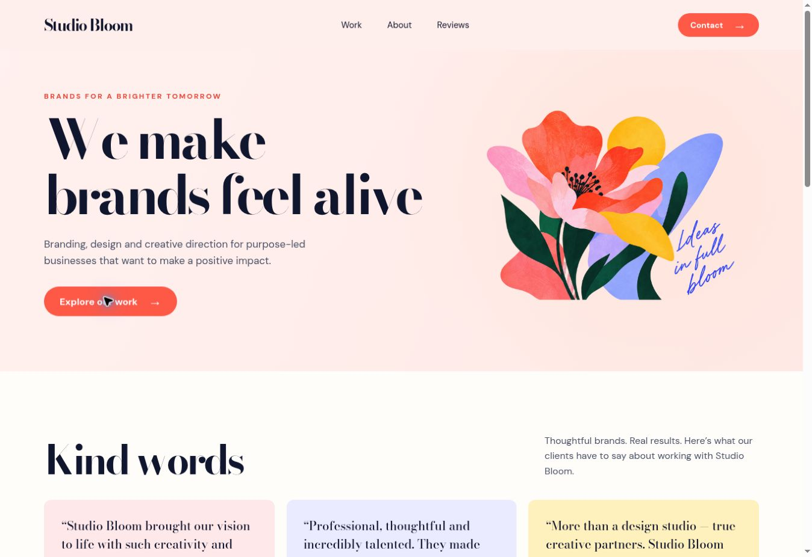

# Studio Bloom — CSS Challenge

A responsive creative studio page built for the WeIntern Week 1 CSS Challenge. The page uses a fictional branding studio to demonstrate Flexbox, CSS Grid, and subtle CSS transitions in a finished interface.

## Live site

[View the live CSS challenge](https://studio-bloom-css-challenge.vercel.app/)

## What the project demonstrates

| Challenge | Implementation |
| --- | --- |
| Flexbox | Three testimonial cards sit in one row on desktop and stack vertically on small screens. |
| CSS Grid | Six project cards display in three columns on desktop, two on tablet, and one on mobile. |
| Animation | The primary button and cards use smooth hover transitions and transforms. |

## Features

- Responsive layout for desktop, tablet, and mobile
- Six branded project images
- Semantic HTML sections and descriptive image alt text
- Visible keyboard focus styles
- Reduced-motion support for visitors who prefer less animation
- Smooth in-page navigation

## Built with

HTML5 and CSS3. No JavaScript, dependencies, or build step are required.

## Run locally

Clone the repository and open `index.html` in a browser:

```bash
git clone https://github.com/Shwetaleena-Kundu/studio-bloom-css-challenge.git
cd studio-bloom-css-challenge
```

## Project structure

```text
studio-bloom-css-challenge/
├── index.html
├── css/
│   └── style.css
├── assets/
│   └── images/
├── screenshots/
└── README.md
```

## Screenshots

### Flexbox — desktop



### Flexbox — mobile



### CSS Grid



### Button hover animation



The hover animation can be viewed by moving the pointer over the **Explore our work** button or the cards on the live site.

## Author

Shwetaleena Kundu
